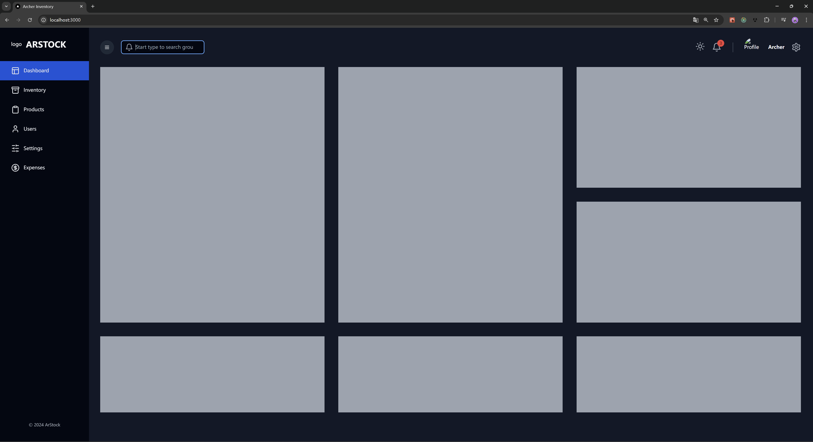
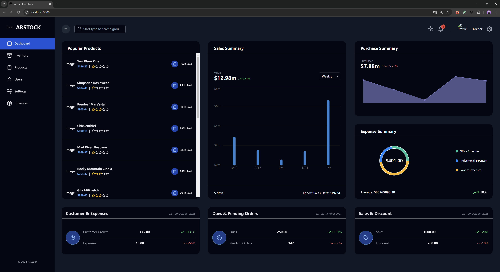
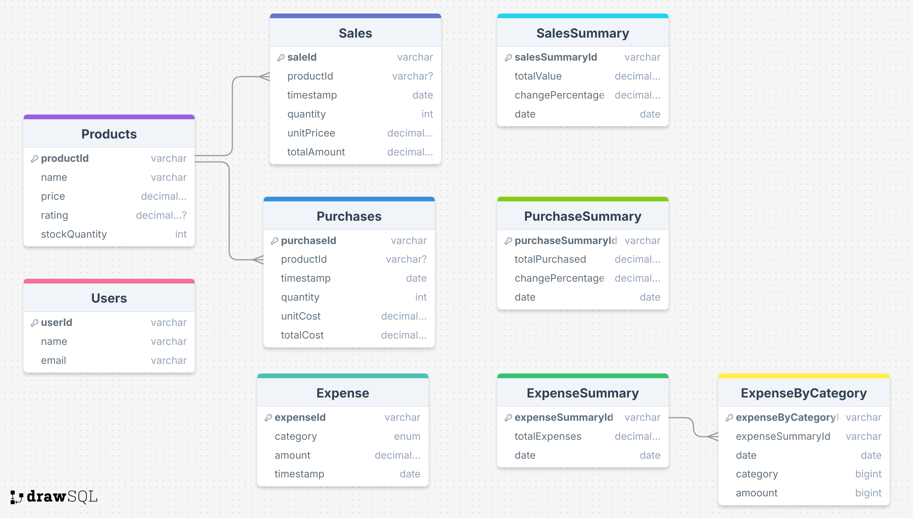
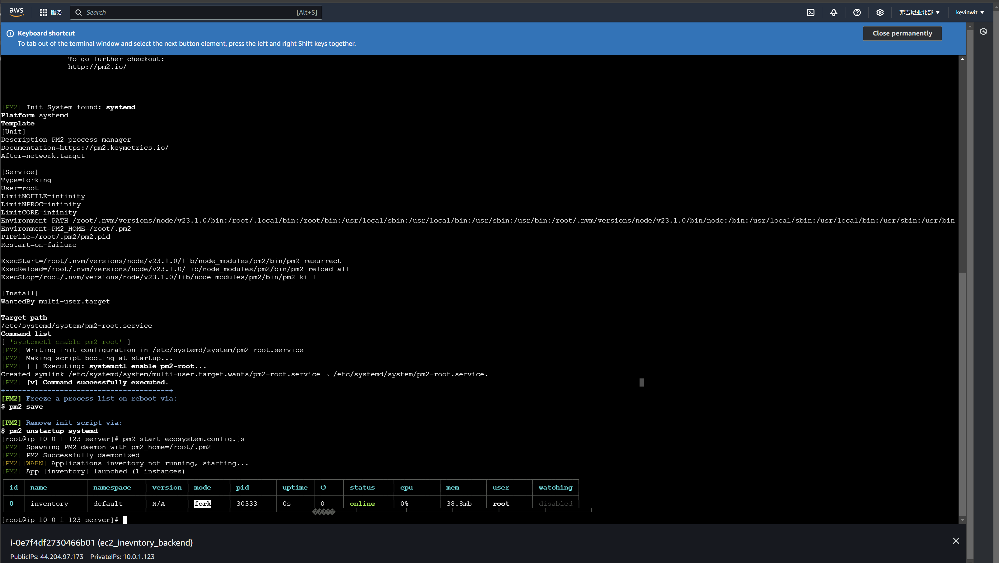
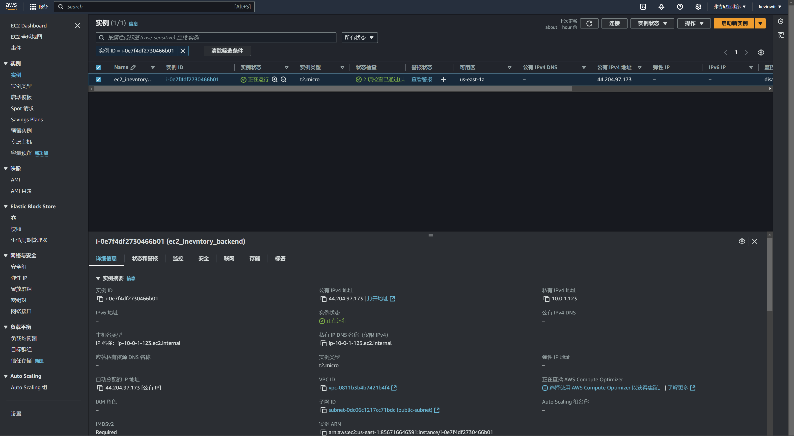
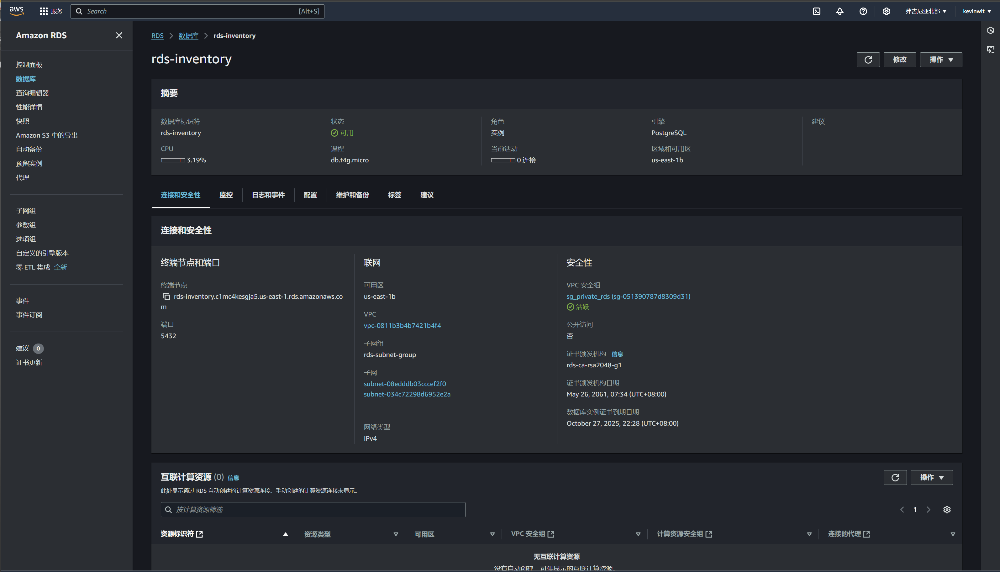
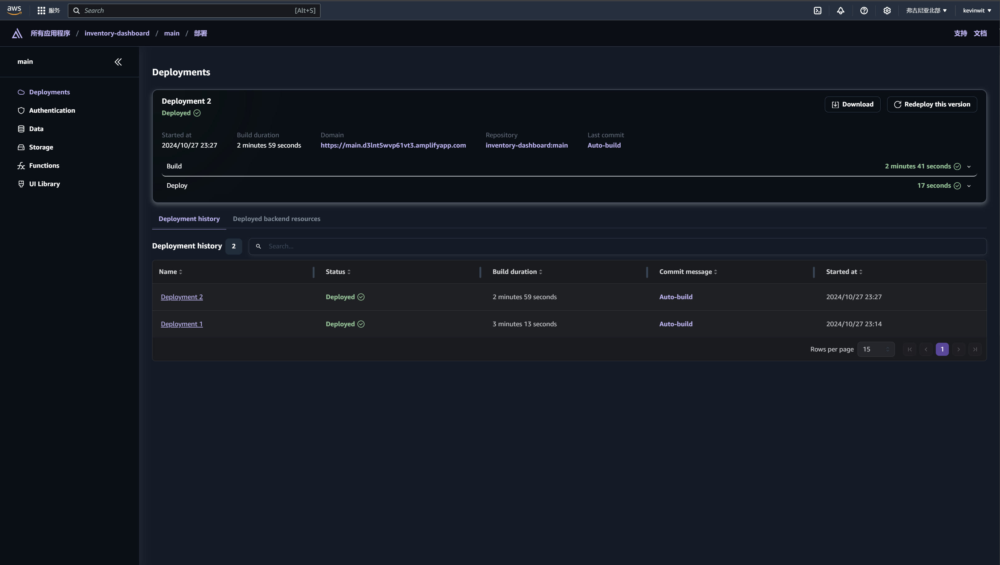
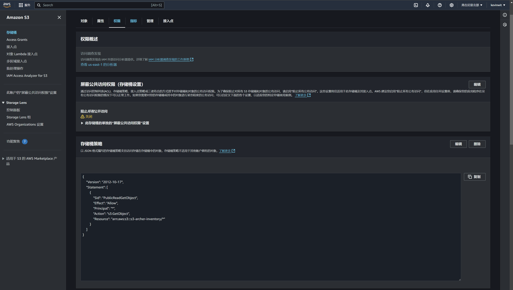

# Build a Fullstack Inventory Management Dashboard

## Screenshots
### Layout

### Home Page

### Database

### AWS

### EC2

### RDS

### AMPLIFY

### S3

## Tech Stack

- **Next JS**
- **Tailwind**
- **Redux Toolkit**
- **Redux Toolkit Query**
- **Material UI Data Grid**
- **Node.js**
- **Prisma**
- **AWS EC2**
- **AWS RDS**
- **AWS API Gateway**
- **AWS Amplify**
- **AWS S3**

